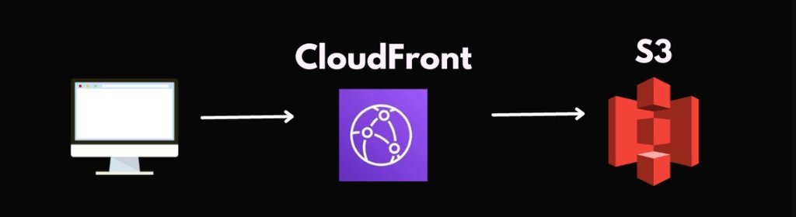

# Static Website hosting with  AWS S3 and Cloudfront



We are going to deploy an static website which can be build using npm run build command. See all the parts of this documentation to understand the architecture. 

**Part 1: Preparing code Repository and Github Actions** 

**Part 2: Preparing S3 bucket to host our website**

**Part 3: Preparing Cloudfront**

**Part 4: Preparing AWS Certificate Manager**

## Part 1: Preparing code Repository and Github Actions

Make ready your code repository. In our case when code is build using `npm run build` then build is made to `/dist`  directory. The content of dist directory will be sent to s3 bucket.


Consider the following github action that build the code and sends the content to s3 as well as set the validation to cloudfront.  Set your desired bucket name for dev, test and prod environment.

```yaml

name: Deploy to s3

on:
  workflow_dispatch:
    inputs:
      deploy-env:
        description: 'Select an environment'
        type: choice
        options:
          - dev
          - test
          - prod
        required: true

jobs:
  process:
    runs-on: ubuntu-latest
    steps:
      # Step 1: Selecting your source
      - name: Checkout code
        uses: actions/checkout@v3
        
      # Step 2: Setting up Node 
      - name: Set up Node.js
        uses: actions/setup-node@v3
        with:
          node-version: '20'
      
      # Step 3: Installing npm dependencies
      - name: Install dependencies
        run: npm install
      
      # Step 4: Build the Docker image
      - name: Build the application
        run: npm run build
        
      # Step 5:  Authenticate to AWS 
      - name: Configure AWS Credentials
        uses: aws-actions/configure-aws-credentials@v1
        with:
          aws-access-key-id: ${{ secrets.AWS_ACCESS_KEY_ID }}
          aws-secret-access-key: ${{ secrets.AWS_SECRET_ACCESS_KEY }}
          aws-region: ${{ secrets.AWS_REGION }}
          
      # Step 6: Setting Bucket Name and Distribution Link
      - name: Set and Echo Variable
        run: |
          if [ "${{ inputs.deploy-env }}" = "dev" ]; then
            echo "BUCKET_NAME=__dev_bucket_name" >> $GITHUB_ENV
            echo "DISTRIBUTION_ID=__dev_distribution_id" >> $GITHUB_ENV
          elif [ "${{ inputs.deploy-env }}" = "test" ]; then
            echo "BUCKET_NAME=__test_bucket_name" >> $GITHUB_ENV
            echo "DISTRIBUTION_ID=__test_distribution_id" >> $GITHUB_ENV
          elif [ "${{ inputs.deploy-env }}" = "prod" ]; then
            echo "BUCKET_NAME=__prod_bucket_name" >> $GITHUB_ENV
            echo "DISTRIBUTION_ID=__prod_distribution_id" >> $GITHUB_ENV
          else
            echo "Invalid input: Expected 'dev' or 'test'"
            exit 1
          fi
          
      # Step 7: Deploy to Bucket and Apply Invalidation to sync edge locations
      - name: Deploy to Bucket
        run: |
          echo "Deploying to ${{ inputs.deploy-env }} environment, bucket: $BUCKET_NAME"
          aws s3 sync dist/ s3://$BUCKET_NAME
          aws cloudfront create-invalidation \
            --distribution-id $DISTRIBUTION_ID \
            --paths "/*"
          echo "Deployed to ${{ inputs.deploy-env }} environment,updated bucket: $BUCKET_NAME"
```

**Give repository secrets as**

AWS_ACCESS_KEY_ID=

AWS_SECRET_ACCESS_KEY=

AWS_REGION=

**Give Varibales  to gitthub Actions Code**

bucker name

cloudfront distribution id.

## Part 2: Preparing S3 bucket to host our website

### **Step 1: Create an S3 Bucket**

1. **Sign in to AWS Console**.
2. In the **Search bar**, type `S3` and click **Amazon S3**.
3. Click on **"Create bucket"**.

### **Step 2: Configure Bucket Name & Region**

1. **Bucket Name**:
    - Enter a **bucket name that matches your domain** (e.g., `cdn.example.com`).
    - The bucket name **must be globally unique**.
2. **AWS Region**:
    - Choose the closest region to your audience for lower latency.

### **Step 3: Public Access Settings**

1. Scroll down to **"Block Public Access settings for this bucket"**.
2. **Uncheck the box** for **"Block all public access"**.
3. Confirm the warning by **checking the acknowledgment box**.

### **Step 4: Bucket Policy (Set up later)**

1. **Skip this step for now** if CloudFront's **Origin Access JSON policy is not available**.
2. After CloudFront generates the **OAC Policy**, update the **Bucket Policy** in the **Permissions tab** of the bucket.

### **Step 5: Bucket Ownership and ACL Settings**

1. Under **"Object Ownership"**, choose:
    - **ACLs disabled** (recommended).
    - **Bucket owner enforced** (this ensures access is controlled by the bucket policy).

### **Step 6: Set Up CORS Configuration**

1. Scroll down to **"Advanced Settings"**.
2. Click on **"Edit CORS Configuration"**.
3. Copy and paste the following JSON configuration:
    
    ```json
    [
        {
            "AllowedHeaders": [
                "*"
            ],
            "AllowedMethods": [
                "GET",
                "PUT",
                "POST",
                "DELETE"
            ],
            "AllowedOrigins": [
                "*"
            ],
            "ExposeHeaders": []
        }
    ]
    ```
    

### **Step 7: Create the Bucket**

1. Review all settings.
2. Click **"Create bucket"**.

### **Step 8: Update Bucket Policy (After CloudFront OAC is Created)**

Once CloudFront **Origin Access Control (OAC)** is created, update the **bucket policy**:

1. Go to **S3 > Your Bucket > Permissions Tab**.
2. Scroll down to **Bucket Policy** and click **Edit**.
3. Paste the **JSON policy provided by CloudFront**.
4. Click **Save changes**.


## Part 3: Preparing Cloudfront Distribution

### **Step 1: Navigate to CloudFront**

1. Sign in to your **AWS Console**.
2. In the **Search bar**, type `CloudFront` and click **Amazon CloudFront**.
3. Click on **"Create Distribution"**.

### **Step 2: Configure the Origin**

1. **Origin Domain Name**:
    - Select your **S3 Bucket** from the dropdown.
2. **Origin Access**:
    - **Choose "Origin Access Control Settings (OAC)"** (instead of Public Access).
    - Click **"Create Control Setting"**.
    - In the popup, provide a **name** and create it.
    - Click **"Use OAC"**.
    - Enable **"Grant Read Permissions on Bucket"**.


### **Step 3: Cache Behavior Settings**

Under **"Default Cache Behavior"**, configure the following:

1. **Path Pattern**:
    - Set it as (*)
2. **Viewer Protocol Policy**:
    - Select **"Redirect HTTP to HTTPS"**.
3. **Allowed HTTP Methods**:
    - Choose **"GET, HEAD, OPTIONS, PUT, POST, PATCH, DELETE"**.
4. **Cache Policy**:
    - Choose **"CachingOptimized"**.
    - **Ensure headers and query strings are allowed**.
5. **Origin Request Policy**:
    - Choose **"AllViewerExceptHostHeader"**.
    - **Ensure headers and query strings are allowed**.

### **Step 4: Default Root Object**

1. Scroll down to **"Settings"**.
2. In **"Default Root Object"**, enter: `index.html`
    
    
    

### **Step 5: Configure Custom Error Pages**

1. Click on **"Error Pages"** tab.
2. Click **"Create Custom Error Response"**.
    - **HTTP Error Code**: `403`
    - **Response Page Path**: `/index.html`
    - **HTTP Response Code**: `200`
3. Click **"Create Custom Error Response"** again.
    - **HTTP Error Code**: `404`
    - **Response Page Path**: `/index.html`
    - **HTTP Response Code**: `200`

### **Step 6: Add Custom Domain & SSL Certificate**

1. Under **"Settings"**, go to **"Alternate domain name (CNAME)"**.
    - Enter your **Custom Domain Name** (e.g., `cdn.example.com`).
2. In **SSL/TLS Certificate**, choose:
    - **"Custom SSL Certificate"**.
    - Select an **existing ACM certificate** or **request a new one** in AWS Certificate Manager.

### Step 7: Set other configurations

1. In the **Web Application Firewall (WAF)** section, choose how you want to integrate your distribution with an [AWS WAF Web ACL](https://docs.aws.amazon.com/AmazonCloudFront/latest/DeveloperGuide/distribution-web-values-specify.html#DownloadDistValuesWAFWebACL) for additional security.
    
    
    
2. In the **Standard logging** section, keep the default selection.
3. Set Bucket policy on the S3 console bucket page:
    - In the **Bucket policy** section, choose **Edit**.
    - In the **Edit statement** field, **paste** the policy that you previously copied. Then, choose **Save changes**.

### **Step 7: Review and Create**

1. Review all the configurations.
2. Click **"Create Distribution"**.
3. Wait for **CloudFront to deploy the distribution** (may take **10-30 minutes**).


## Part 4: Preparing AWS Certificate Manager

Everyone wants that his website is recognized with a unique name. Purchasing a domain name is a good idea. Let’s see how to set up the domain name for our website.

## Requirements

- You should have a personal domain name and access to your domain name provider's dashboard.
- Write down the subdomains you want to link to your website.
- Ensure your website is already hosted on S3 with "ACL enabled" and "public access enabled."
- Your CloudFront distribution should be ready and pointing to your S3 website with an updated bucket policy and an active distribution domain name.

## Step 1: Requesting a certificate from AWS Certificate Manager

1. Go to the AWS Certificate Manager service and select the 'US East (N. Virginia)' region. This region acts as a central hub for distributing certificates for CloudFront distributions.
2. Request a certificate. When prompted for the certification type, select "Request a public certificate" and then click "Next." On the next page, when asked for Domain Names, provide the fully qualified domain names, meaning a list of subdomains along with the root domain. Keep all other settings at their default values and click the "Request" button.


1. On the next screen, you will see the certificate state as "pending." Copy the "Record Name" and "Value" and paste them into the DNS Record Set database of your DNS provider. Soon, the status of your certificate will change to "verified."


1. If you've followed all the steps correctly and the certificate validation is still pending in AWS Certificate Manager, consider creating a hosted zone in Route 53. Replace the existing nameservers with those provided by Route 53. This will allow you to manage all DNS records, including those required for certificate validation, within Route 53.

## Step 2: Add Domain to Cloudfront

1. To configure your CloudFront distribution, navigate to the distribution and click "Edit" to access its settings. In the "Alternate Domain Names" section, enter the list of domains (including subdomains) that you want to associate with your website. Select the custom SSL certificate that you created in the N. Virginia region of AWS Certificate Manager. Finally, click "Save Changes" to apply your configurations.


1. Now, add CNAME records to your DNS dashboard or hosted zone. Set the "Name" of each record to the corresponding subdomain, and set the "Value" to the distribution domain name obtained from your CloudFront distribution.


Please allow some time for the domain name provider to update its name servers with the changes you've made.